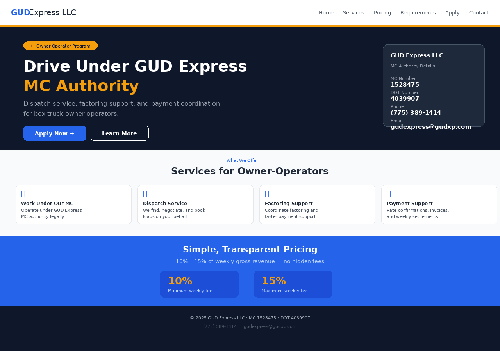

# GUD Express LLC — Owner-Operator Website

[](https://github.com/dukens11-create/Gud-express-/actions/workflows/build.yml)



A professional React + Vite website for **GUD Express LLC** — helping box truck owner-operators
work under MC authority with dispatch service, factoring support, and payment coordination.

---

## Features

- Professional homepage with company info, pricing, and service details
- Box truck owner-operator program details (MC / DOT numbers)
- Dispatch, factoring, and payment support sections
- Formspree-powered online driver application with document upload support
- Mobile-responsive design with hamburger navigation
- SEO-ready: Open Graph + Twitter Card meta tags
- SVG favicon

---

## Insurance, W-9, and Truck Registration Policy

> **All drivers must use Gud Express-provided Insurance, W-9, and Truck Registration.**

Applicants are **not** asked to provide their own insurance, W-9, or truck registration documents.
Gud Express handles all three on behalf of every driver:

| Document | Policy |
|---|---|
| **Insurance** | All drivers work under Gud Express insurance. Do not provide your own. |
| **W-9** | All drivers use the Gud Express W-9. Do not provide your own W-9. |
| **Truck Registration** | All trucks must be registered under Gud Express. Do not provide your own registration. |

This policy is reflected in the application form (no upload fields for these documents) and in the
requirements checklist shown on the website.

---

## Company Info

| Field | Value |
|-------|-------|
| Company | GUD Express LLC |
| MC | 1528475 |
| DOT | 4039907 |
| Phone | (775) 389-1414 |
| Email | gudexpressllc@gmail.com |

---

## Requirements

- [Node.js](https://nodejs.org/) 18 or newer
- npm (comes with Node.js)

---

## Run Locally

```bash
# 1. Install dependencies
npm install

# 2. Start the development server
npm run dev
```

Open your browser at **http://localhost:5173** (Vite's default port).

---

## Build for Production

```bash
npm run build
```

Production-ready files are output to the `dist/` folder.

## Preview the Production Build

```bash
npm run preview
```

---

## Deploy

You can deploy the `dist/` folder to any static hosting service:

| Platform | How to deploy |
|---|---|
| **Netlify** | Drag and drop the `dist/` folder at [netlify.com/drop](https://app.netlify.com/drop), or connect your GitHub repo |
| **Vercel** | Run `npx vercel` in the project root, or connect your GitHub repo at [vercel.com](https://vercel.com) |
| **GitHub Pages** | Use the [gh-pages](https://www.npmjs.com/package/gh-pages) npm package or a GitHub Actions deploy workflow |
| **Cloudflare Pages** | Connect your GitHub repo at [pages.cloudflare.com](https://pages.cloudflare.com) — build command: `npm run build`, output dir: `dist` |

---

## Project Structure

```
Gud-express-/
├── public/
│   └── favicon.svg         # Browser tab icon — replace with your own
├── index.html              # HTML entry point (SEO meta tags live here)
├── vite.config.js          # Vite + React plugin configuration
├── package.json            # Project dependencies and scripts
├── .github/
│   └── workflows/
│       └── build.yml       # CI: runs npm build on every push/PR
└── src/
    ├── main.jsx            # React app — all page sections in one file
    ├── styles.css          # Global CSS styles
    └── assets/
        ├── gud-logo.png    # BRANDING: Replace with your actual logo
        ├── truck.png       # IMAGES:   Replace with a real truck photo
        └── team.png        # IMAGES:   Replace with a real team/ops photo
```

---

## Customization Guide

| What to change | Where |
|---|---|
| Company name, MC, DOT, phone, email | `src/main.jsx` → `COMPANY` constant |
| Services offered | `src/main.jsx` → `services` array |
| Application requirements checklist | `src/main.jsx` → `requirements` array |
| Google Form link / embed | `src/main.jsx` → `GOOGLE_FORM_URL` and `GOOGLE_FORM_EMBED_URL` constants |
| Logo image | Replace `src/assets/gud-logo.png` (see **Logo Asset** section below) |
| Hero truck photo / application image | Replace `src/assets/truck.png` with image2 (Gud Express branded semi truck) |
| Team / operations photo | Replace `src/assets/team.png` |
| Tab favicon | Replace `public/favicon.svg` |
| SEO / Open Graph meta tags | `index.html` — update `og:url` and `og:image` |
| Brand colors | `src/styles.css` — search for `#2563eb` (blue) and `#f59e0b` (amber) |

---

## Logo Asset

The Gud Express logo is displayed in the sticky header at the top of every page.

**Asset location:** `src/assets/gud-logo.png`

**How to update the logo:**

1. Prepare a high-resolution PNG or SVG of your logo (recommended minimum: **400 × 200 px**,
   transparent background preferred).
2. Replace `src/assets/gud-logo.png` with your new file (keep the same filename, or update the
   import at the top of `src/main.jsx`).
3. The header CSS (`src/styles.css` → `.brand img`) uses `object-fit: contain` and `width: auto`
   so the full logo is always shown without cropping or letter cutoff, regardless of aspect ratio.
   The logo scales to a maximum height of **54 px** on desktop; on small screens it is capped at
   **48 px**.
4. Run `npm run build` and verify the logo looks crisp in both desktop and mobile views.

> **Alt text** — The logo `` element includes a descriptive `alt` attribute
> (`"Gud Express LLC — Box Truck & Semi Truck Owner-Operator Dispatch"`) for accessibility and SEO.
> Update this text in `src/main.jsx` → `Header()` if your branding changes.

---


The site sends a **POST request to a webhook URL** every time the homepage loads, so you can be
notified of each visit via email, SMS, Slack, Discord, and more.

### How to Set It Up

1. Open `src/main.jsx` and search for `WEBHOOK_URL`.
2. Replace the placeholder value with your real webhook URL:

   ```js
   const WEBHOOK_URL = 'https://your-webhook-url-here.com/notify' // ← replace this
   ```

3. Rebuild and redeploy the site (`npm run build`).

### Recommended Free Webhook Services

| Service | What it does | URL format |
|---|---|---|
| **IFTTT Webhooks** | Sends you an email / push notification | `https://maker.ifttt.com/trigger/YOUR_EVENT/with/key/YOUR_KEY` |
| **Zapier Webhooks** | Routes the event to 5,000+ apps (email, Slack, sheets…) | Get URL from your Zap's "Catch Hook" step |
| **Make (Integromat)** | Powerful automation, free tier available | Get URL from your scenario's Webhook module |
| **Discord Webhook** | Posts a message to a Discord channel | Create via channel Settings → Integrations → Webhooks |
| **Slack Incoming Webhook** | Posts a message to a Slack channel | Create via api.slack.com/apps → Incoming Webhooks |

### Customizing the Payload

By default the request body contains:

```json
{
  "event": "page_visit",
  "page": "homepage",
  "timestamp": "2025-01-01T00:00:00.000Z"
}
```

You can add extra fields (e.g. `referrer: document.referrer`) in the `body` object inside
the `useEffect` hook in `src/main.jsx`.

### Privacy Considerations

- **Do not send personally identifiable information (PII)** — e.g. IP addresses, user-agent strings,
  or any data that could identify a specific individual — without a clear privacy policy and user
  consent, as required by GDPR, CCPA, and similar laws.
- For high-traffic sites, a webhook ping on every single visit may become noisy. Consider switching
  to an analytics platform (Google Analytics, Plausible, Fathom) or adding rate-limiting logic.
- If the webhook endpoint is unreachable, the site continues to work normally — errors are silently
  ignored so visitors are never affected.

---

## Formspree Integration

The application form uses **Formspree** to collect driver applications and deliver them to
`gudexpressllc@gmail.com`. Formspree is a front-end form service — no server-side code needed.

### How it works

- Applicants fill in the form on the page and click **Submit Application**.
- The form is posted via `fetch` to the Formspree endpoint.
- Formspree delivers the submission to `gudexpressllc@gmail.com`.
- Applicants see a success message. On failure, they see a contact fallback screen.

### Form fields collected

| Field | Type |
|---|---|
| Full Name | Text |
| Phone Number | Text |
| Email | Email |
| City / State | Text |
| Truck Size | Dropdown (16–26 ft box truck, Other) |
| Years of Experience | Text |
| Ready to Start | Dropdown |
| Driver License | File upload |
| Voided Check / Direct Deposit | File upload |
| Message | Textarea |

### How to update the Formspree endpoint

1. Sign up / log in at [formspree.io](https://formspree.io).
2. Create a new form — set recipient to `gudexpressllc@gmail.com`.
3. Copy the new Form ID (e.g. `xabcdefg`) from your Formspree dashboard.
4. Open `src/main.jsx`, find `FORMSPREE_ENDPOINT`, and replace the form ID:
   ```js
   const FORMSPREE_ENDPOINT = 'https://formspree.io/f/xabcdefg'
   ```
5. Rebuild and redeploy: `npm run build`

### Spam protection

A hidden `_gotcha` honeypot field is included in the form. Bots that fill in hidden fields
are automatically rejected by Formspree. For additional protection, enable reCAPTCHA in your
Formspree dashboard under **Settings → Spam Filtering**.

---

## How to Restore the Unified Google Form Application

If you want to switch back from the Formspree form to a Google Form (e.g. to collect document
uploads through Google Drive), follow these steps:

### 1. Build a Google Form

Go to [forms.new](https://forms.new) and create your application form. Include:
- Short-answer fields: **Full Name**, **Phone**, **Email**, **City/State**
- Dropdown: **Truck Type** (Semi, Box Truck 16 ft, 20 ft, 22 ft, 24 ft, 26 ft, Hotshot, Other)
- Short answer: **Years of Experience**
- Dropdown: **Ready to Start** (Immediately / This week / This month / Later)
- File upload: **Driver License**
- File upload: **Voided Check / Direct Deposit Info**
- Paragraph: **Message / notes**

### 2. Update `src/main.jsx`

Replace the Formspree-based `Application` component with the Google Form version.
The key constants and component you need to add back are:

```js
// Google Form share URL
const GOOGLE_FORM_URL = 'https://forms.gle/YOUR_FORM_ID_HERE'

// Google Form embed URL (from Send → Embed → copy src="…")
const GOOGLE_FORM_EMBED_URL = 'https://docs.google.com/forms/d/e/YOUR_LONG_ID/viewform?embedded=true'

// True once the real URL is set
const formReady = !GOOGLE_FORM_URL.includes('REPLACE_WITH_YOUR_FORM_ID')
```

Replace the `Application()` function body with an `<iframe>` pointing to `GOOGLE_FORM_EMBED_URL`
when `formReady` is true, and a contact-us card when it is false (see git history for the full
component — commit `70f0f9f`).

### 3. Update the import line

Remove `UploadCloud`, `Send`, `Loader2` and add `ExternalLink`, `Truck` to the lucide-react import.

### 4. Add back the semi-truck image

Re-add the `semiTruckImg` import and the `<figure>` element that displays it in the application
section (see commit `1d817e7` for the exact code).

### 5. Add CSS for the Google Form layout

In `src/styles.css`, add back the `.semiTruckBanner`, `.googleFormSide`, `.googleFormFrame`,
`.googleFormOpenLink`, and `.googleFormPlaceholder` rules (see commit `70f0f9f` for the styles).

### 6. Rebuild and redeploy

```
npm run build
```

---

## Important Note — Document Collection

Driver license and direct deposit documents are currently collected via Formspree's file upload
fields. All uploaded files are delivered to `gudexpressllc@gmail.com`.

If you switch to Google Forms, files are stored in the Google Drive account that owns the form.

---

## Truck &amp; Team Images

Key image files in `src/assets/`:

| File | Replace with |
|---|---|
| `src/assets/truck.png` | **Box truck image** — used in the hero section. Replace with a high-quality photo of your box truck. |
| `src/assets/team.png` | Real team or operations photo |
| `src/assets/team-ops1.jpg` | Dispatcher coordinating routes at a workstation |
| `src/assets/team-ops2.jpg` | Team collaborating in an operations center |
| `src/assets/team-ops3.jpg` | Driver support representative assisting an owner-operator |

To swap in your own photos, replace the files listed above and rebuild:
`npm run build`